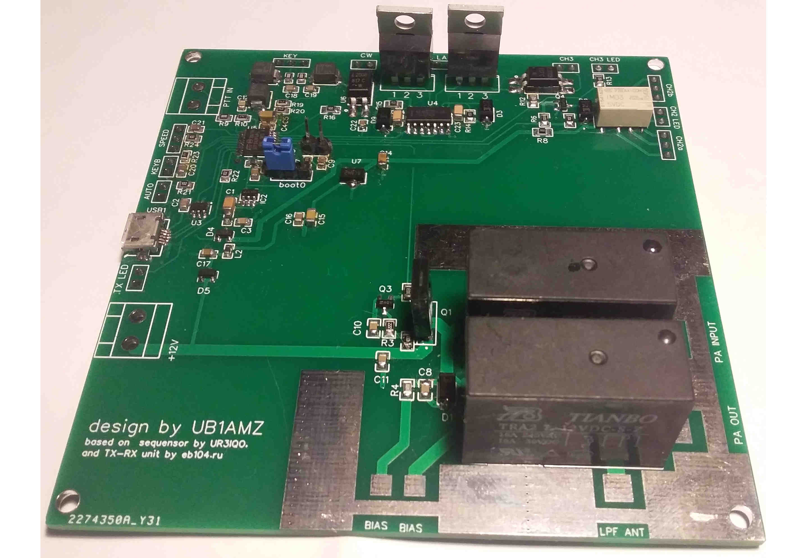

Секвенсор со встроенным телеграфным ключом  и USB интерфейсом.

### Функции устройства:

* Устройство видно в системе, как два COM порта при подключении через USB интерфейс.
* Скорость телеграфирования (CW) настраивается в пределах от 1 до 45 WPM (слов в минуту) (Может быть изменено в исходных кодах).
* Секвенсор поддерживает до 4 линий коммутации TX/RX с настраиваемыми временем задержки включения и отключения. 
* Секвенсор  содержит один оптоэлектронный выход коммутации, один выход на основе слаботочного реле, один интерфейс управления для поляризованных реле, один выход коммутации на "Большом реле" для коммутации выхода прием/передача.
* В режиме передачи устройство может подавать напряжение смещения (bias) для управления работой внешних устройств.
* Секвенсор содержит 2 вывода для светодиодной индикации.
* Выход телеграфной манипуляции с оптоэлектронной развязкой.
* Выход телеграфной манипуляции может быть запрограммирован, как пятый вывод секвенсора.
* Вход линии PTT содержит защитную цепь.
* Есть выход для подключения светодиодного индикатора режима передачи.
* Программирование и настройка осуществляется через USB порт (В режиме консоли COM порта).
* Программы для ведения лога и контестов могут взаимодействовать с устройством, посредством эмуляции протокола Winkey  K1EL версии 1 или 2 . (Через второй COM порт).
* Плата содержит разъем для подключения переменного резистора для регулировки скорости телеграфной манипуляции.
* Поддерживается режим телеграфного ключа «Iambic A» и «Iambic B".
* Поддерживается обучный прямой телеграфный ключ (клоподав).
* Поддерживается режим «Ultimatic».
* Bug mode.
* CMOS Super Keyer Iambic B Timing.
* Поддерживается реверс направления точка/тире для автоматического ключа.
* Поддерживается компенсация манипуляции.
* Поддерживается настройка различных отношений длительности тире и точки.
* Autospace.
* Wordspace Adjustment.
* Почти все настройки храняться в энергонезависимой Flash памяти.
* Поддерживаются кириллические символы .

Список доступных консольных команд:

"DEFAULT" 
Команда возвращает все настройки секвенсора в изначальное состояние (factory reset)

"HEAD N x ms"
Установка задержки коммутации указанного канала секвенсора на передачу в указанное значение в миллисекундах.
Параметры:
N–  значение от 1 до 4. Номер канала секвенсора.
x – значение от 1 до 500. Время задержки коммутации на передачу, указанного канала секвенсора.

"TAIL N x ms"
Установка задержки коммутации указанного канала секвенсора при переходе на прием (время задержки отпускания с передачи) в указанное значение в миллисекундах.
Параметры:
N–  значение от 1 до 4. Номер канала секвенсора.
x – значение от 1 до 500. Время задержки коммутации на прием (время задержки отпускания с передачи), указанного канала секвенсора.

"REV x x"
Установка реверсивного или нормального начального состояния указанного канала секвенсора.
Параметры:
N–  значение от 1 до 4. Номер канала секвенсора.
x- если указан ноль, то канал находится в обычном режиме (разомкнут на приеме и коммутируется при переходе на передачу), если указано не нулевое число, канал находится в реверсивном режиме (скоммутирован в режиме приема и отпускается в режиме передачи).

"CW_REV x"
Установка реверсивного или нормального режима манипулятора телеграфного ключа.
Параметры:
x- если указан ноль, то манипулятор считается находящимся в нормальном режиме, положение точки и тире соответствуют подключению по схеме. Если если указано не нулевое число, то направление точки и тире меняются местами.

"KEYREVERSE x"
Установка реверсивного или нормального начального состояния выхода манипуляции телеграфного сигнала.
Параметры:
x- если указан ноль, при передачи посылки (точки или тире) цепь замыкается, начальное состояние разомкнутое.  Если если указано не нулевое число, то изначально цепь замкнута, а при передаче посылки цепь размыкается.

"DOTRATIO x"
Установка отношения длительности посылки тире и точки при телеграфной манипуляции.
Параметры:
x- значение от 2 до 9. Соответствует отношению длительности тире к длительности точки при телеграфной манипуляции.

"WPM x"
Установка скорости телеграфной манипуляции в WPM (слов в секунду).
Параметры:
x- значение от 1 до 99. Соответствует скорости телеграфной манипуляции в WPM. Обратите внимание: скорость так-же может меняться при помощи потенциометра и через интерфейс winkey.

"HANGTIME x"
Установка задержки при переходе на прием после окончания телеграфной манипуляции в миллисекундах.
Параметры:
x- значение от 0 до 99. Определяет задержку для перехода в режим приема после окончания телеграфной манипуляции.

"KEYMODE s"
Установка режима работы телеграфного ключа.
Параметры:
s – может принимать следующие значения:
STRAIGHT — устанавливается режим STRAIGHT.
IAMBIC_B — устанавливается режим  IAMBIC, подрежим B.
IAMBIC_A — устанавливается режим IAMBIC подрежим A.
BUG — устанавливается режим  BUG.
ULTIMATIC — устанавливается режим  ULTIMATIC.
SINGLE — устанавливается режим SINGLE.

"D"
Команда выводит текущие настройки секвенсора. Параметров не имеет.

Схема секвенсора и платы PCB находится в проекте easyeda:

	https://easyeda.com/ys1797/pa_sequencer

 

The board schematic and part of PCB design based on the development of the following authors:

	"Sequencer with CW memory keyer 2018 UR3IQO:
	https://vhfdesign.com/ru/other/cw-key-sequencer.html"

	"RA3KBO 4 TX-RX unit PTT board:
	https://eb104.ru/internet-magazin/vhf-power-amplifier/vhf-tx-rx-unit-ptt-board"

This code based on previous work by the following authors:
	"K3NG Arduino CW Keyer Copyright 2010 - 2020 Anthony Good, K3NG"
	"morse generator module COPYRIGHT(c) 2016 S54MTB"
	"Examples from Copyright (c) 2020 STMicroelectronics."

    This program is free software: you can redistribute it and/or modify
    it under the terms of the GNU General Public License as published by
    the Free Software Foundation, either version 3 of the License, or
    (at your option) any later version.

    This program is distributed in the hope that it will be useful,
    but WITHOUT ANY WARRANTY; without even the implied warranty of
    MERCHANTABILITY or FITNESS FOR A PARTICULAR PURPOSE.  See the
    GNU General Public License for more details.

    You should have received a copy of the GNU General Public License 
    along with this program.  If not, see <http://www.gnu.org/licenses/>.
